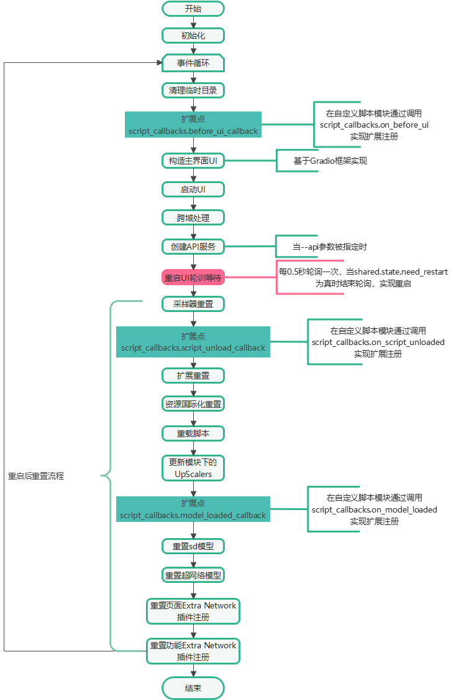

## 下载安装anaconda
conda create -n stable-diffusion-env python=3.10.13

## 启动 launch.py
无论是在windows还是linux、macos，利用脚本进行启动的时候，实际上它都是调用了stable diffusion webui安装根目录下的launch.py这个脚本进行启动。

### launch.py主要做以下几件事
获取命令行参数  
获取系统默认参数  
系统启动环境准备(函数：prepare_environment)  
系统启动(函数：start， 调用webui.webui())  

## webui.py

## 总结
launch.py会调用webui.py完成前端界面的构建以及扩展的加载与处理，webui.sh那个是一个shell脚本，里面会设置环境变量后，会调用launch.py

## RDNA2 环境变量
AMD显卡是 5000 6000 系，添加环境变量：export HSA_OVERRIDE_GFX_VERSION=10.3.0

A卡命令行启动：HSA_OVERRIDE_GFX_VERSION=10.3.0 python3 launch.py --medvram --opt-split-attention